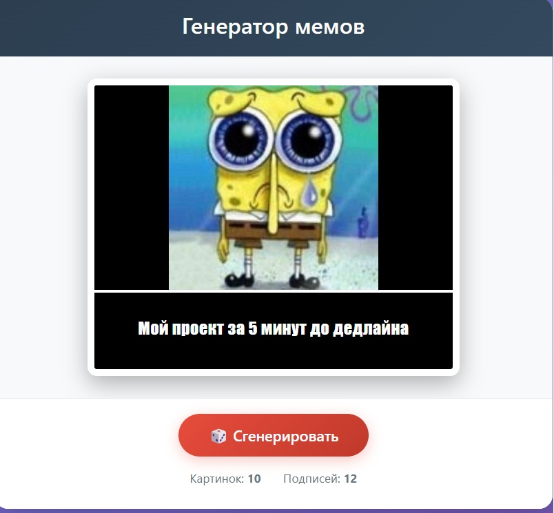
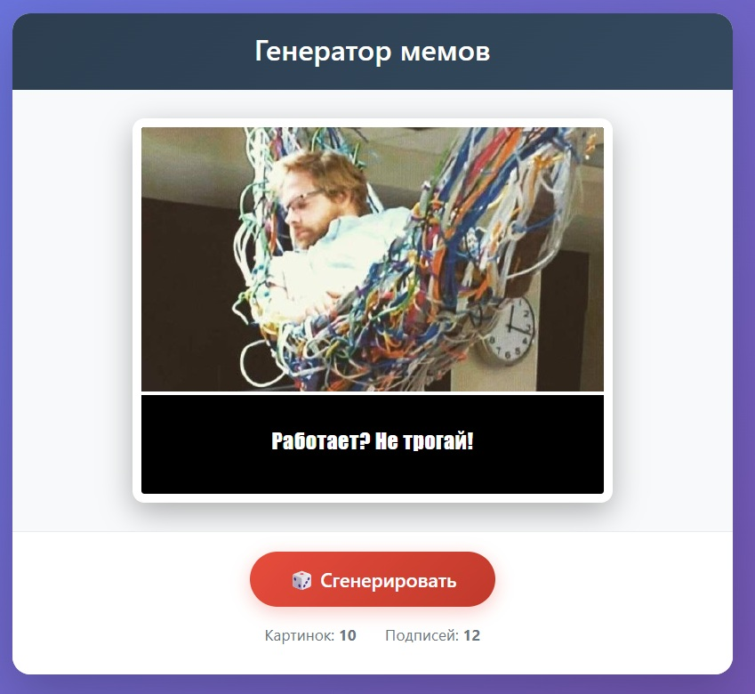

# Функционал 
• По нажатию на кнопку сгенерировать приложение создает мем
# Технологии
• React  
• JSX  
• JavaScript  
• CSS   
# Скриншоты работы

• На начальном экране приложение автоматически генерирует мем

По нажатию на кнопку приложение создает новый мем

